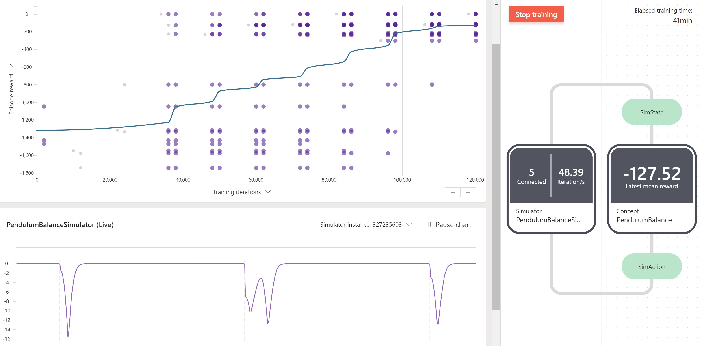

# bonsai-gym

OpenAI Gym is a toolkit for developing and comparing reinforcement learning algorithms. 
https://github.com/openai

Full documentation for Bonsai's Platform can be found at https://docs.bons.ai. The bonsai-ai documentation specifically can be found in Bonsai's Python Library Reference.

Bonsai need two environment variables set to be able to attach to the platform.

The first is SIM_ACCESS_KEY. You can create one from the Account Settings page. You have one chance to copy the key once it has been created. Make sure you don't enter the ID.

The second is SIM_WORKSPACE. You can find this in the URL after /workspaces/ once you are logged in to the platform.

There is also an optional SIM_API_HOST key, but if it is not set it will default to https://api.bons.ai.

If you're launching your simulator from the command line, make sure that you have these two environment variables set. If you like, you could use the following example script:

export SIM_WORKSPACE=<your-workspace-id>
export SIM_ACCESS_KEY=<your-access-key>
python3 cartpole.py
You will need to install support libraries prior to running. Our demos depend on bonsai3-py. This library will need to be installed from source. The cartpole-py repository should be in a folder called samples at the same level as bonsai3-py.

You can also clone bonsai3-py directly here.

pip3 install -e ./bonsai3-py
This is the gym open-source library, which gives you access to a standardized set of environments.

Integration between Bonsai AI and Open AI gym environments
# Environments

## Pendulum

### Trained:

## Mountain Car

### Trained:

